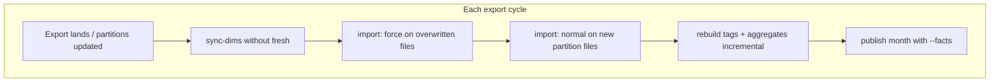

```powershell
go build -o focus-ingest.exe ./cmd/focus-ingest

# Hybrid local ETL + SQL Server publish (recommended for Azure DTU limits)

# Historical backfill (aggregates + dims only; no detailed facts on server):
foreach ($month in $months) {
  .\focus-ingest.exe sync-dims --local --connection "<conn>" --sqlite-path "focus_$month.db" --fresh
  .\focus-ingest.exe import --local --sqlite-path "focus_$month.db" --skip-tags --skip-aggregates $file
  .\focus-ingest.exe rebuild --local --sqlite-path "focus_$month.db" --tags --aggregates --full
  .\focus-ingest.exe publish --connection "<conn>" --sqlite-path "focus_$month.db" --billing-period $month
}

# Daily / current month (include detailed facts on server):
.\focus-ingest.exe sync-dims --local --connection "<conn>" --sqlite-path focus_current.db
.\focus-ingest.exe import --local --sqlite-path focus_current.db --skip-tags --skip-aggregates daily.parquet
.\focus-ingest.exe rebuild --local --sqlite-path focus_current.db --tags --aggregates
.\focus-ingest.exe publish --connection "<conn>" --sqlite-path focus_current.db --billing-period 2026-06-01 --facts

# Direct SQL Server import (legacy; heavy on DTU):
.\focus-ingest.exe schema apply --connection "<conn>"
.\focus-ingest.exe import --connection "<conn>" --skip-tags --skip-aggregates daily.parquet
.\focus-ingest.exe rebuild --tags --connection "<conn>"
.\focus-ingest.exe rebuild --aggregates --connection "<conn>"
```

`import --local` auto-runs `sync-dims --fresh` when the local database has no dimensions (requires `--connection` or `FOCUS_DATABASE_URL`).


---

Your export pattern fits the hybrid pipeline well if you treat **one SQLite database per billing month** and **one publish per month** — not one DB/file per parquet.

## Core concepts

| Concept | What to use |
|--------|-------------|
| **Local DB** | One file per billing month, e.g. `focus_2025-01.db`, `focus_2026-06.db` |
| **Parquet files** | 6–7 partitions per month; import **all of them into the same DB** |
| **Duplicate detection** | By **filename** (basename). Already imported → **skipped** unless `--force` |
| **Growing partitions** | Export **overwrites** the same file → you **must** use `--force` on re-import |
| **New partition** | New filename (partition hit max size) → normal import, no `--force` |
| **Server** | One `publish` per month replaces that month’s aggs (and facts if `--facts`) |

Assumption: partition files for a month are **non-overlapping** (each charge line appears in one file). If the same grain appears in two batches, local facts can duplicate and aggregates would over-count.

---

## Historical backfill (closed months)

Process months **in chronological order** (M1 → M2 → …) so anomaly lookback on SQL Server has prior `agg_app_*` months.

### Per billing month (e.g. January 2025)

```powershell
$month = "2025-01-01"   # billing_period_start for that month
$db    = "focus_2025-01.db"
$conn  = "<azure connection>"

# 1) Seed dimensions from Azure (fresh empty DB for this month)
.\focus-ingest.exe sync-dims --connection $conn --sqlite-path $db --fresh

# 2) Import ALL partition files for January (6–7 files)
#    Pass every file in one command, or loop — each unique filename = one batch
.\focus-ingest.exe import --local --sqlite-path $db --skip-tags --skip-aggregates `
  .\exports\2025-01\part001.parquet `
  .\exports\2025-01\part002.parquet `
  .\exports\2025-01\part003.parquet `
  # ... part004 through part007

# 3) Rebuild once after ALL partitions are loaded
.\focus-ingest.exe rebuild --local --sqlite-path $db --tags --aggregates --full

# 4) Publish to Azure (aggregates + new dims only; no detailed facts)
.\focus-ingest.exe publish --connection $conn --sqlite-path $db --billing-period $month
```

### Notes for history

- **No `--force`** if each file is imported once and never changes.
- **`--full` on rebuild** because you loaded the whole month in one shot.
- **No `--facts`** for closed months — server keeps aggs/dims; detailed facts only for the current month.
- **Next month**: new DB `focus_2025-02.db`, `sync-dims --fresh` again (pulls dims expanded by January’s publish).
- If a file fails mid-month loop, re-run only missing files; already-imported names are skipped until you add `--force`.

---

## Daily / current month (rolling partitions)

Use **one rolling DB** for the open billing month, e.g. `focus_2026-06.db`.



### Start of a new billing month

```powershell
$month = "2026-06-01"
$db    = "focus_2026-06.db"

.\focus-ingest.exe sync-dims --connection $conn --sqlite-path $db --fresh
# Then daily loop below
```

### Every day (or after each export drop)

```powershell
$month = "2026-06-01"
$db    = "focus_2026-06.db"

# 1) Refresh dims from server (no --fresh: keeps local-only new dims, merges server state)
.\focus-ingest.exe sync-dims --connection $conn --sqlite-path $db

# 2) Import partitions — THIS IS THE IMPORTANT PART
```

#### Partition import rules

| File situation | Command |
|----------------|---------|
| **Active partition** (export overwrites same file, grows daily) | `--force` |
| **Brand-new partition** (max size reached, new filename) | normal import |
| **Closed partition** (full, no longer changes) | skip (auto) or import without `--force` |

**Practical daily pattern** (week 1: only `part001` exists and grows):

```powershell
# Day 1–N while part001 is still the only/active file:
.\focus-ingest.exe import --local --sqlite-path $db --skip-tags --skip-aggregates --force `
  .\exports\current\part001.parquet
```

**When `part002` appears** (part001 stopped growing):

```powershell
.\focus-ingest.exe import --local --sqlite-path $db --skip-tags --skip-aggregates --force `
  .\exports\current\part001.parquet    # only if still overwritten; else omit

.\focus-ingest.exe import --local --sqlite-path $db --skip-tags --skip-aggregates `
  .\exports\current\part002.parquet    # first time — no --force
```

**Simple but slower** (safe default): `--force` on **all** partitions every run:

```powershell
.\focus-ingest.exe import --local --sqlite-path $db --skip-tags --skip-aggregates --force `
  .\exports\current\part*.parquet
```

`--force` purges the old batch for that filename and re-imports — correct for overwritten files; wasteful but harmless for unchanged closed partitions.

```powershell
# 3) Rebuild (incremental — no --full)
.\focus-ingest.exe rebuild --local --sqlite-path $db --tags --aggregates

# 4) Publish full month snapshot to Azure (facts + aggs + dims)
.\focus-ingest.exe publish --connection $conn --sqlite-path $db --billing-period $month --facts
```

### Why `publish` every day with `--facts`

`publish` **deletes and re-inserts** that month on SQL Server for facts and aggs. Each run is a **full month snapshot** from local SQLite — right for a growing month where partitions change daily.

---

## End of month → next month

```powershell
# Final publish for June (optional last --facts)
.\focus-ingest.exe publish --connection $conn --sqlite-path focus_2026-06.db --billing-period 2026-06-01 --facts

# July: new local DB
.\focus-ingest.exe sync-dims --connection $conn --sqlite-path focus_2026-07.db --fresh
# ... daily loop with focus_2026-07.db
```

On SQL Server you can stop publishing `--facts` for June once July is live if you only want **current-month** detail on Azure (per your original plan).

---

## Quick reference

| Phase | DB | Import | Rebuild | Publish |
|-------|-----|--------|---------|---------|
| **History month** | `focus_YYYY-MM.db` new each month | All partitions once, no `--force` | `--full` | No `--facts` |
| **Current month daily** | Same DB all month | `--force` on growing files; new files normal | incremental | `--facts` every run |
| **Re-import same filename** | same | **`--force` required** | yes | yes |

---

## Pitfalls to avoid

1. **Skipping `--force` on overwritten partitions** — import says “already imported” and data stays stale.
2. **One DB per parquet file** — use one DB per **billing month**.
3. **`publish` before all partitions loaded** (history) — run publish only after all 6–7 files + rebuild.
4. **`sync-dims --fresh` mid-month** — wipes local facts/staging; only use `--fresh` at month start or for historical one-shot DBs.
5. **`billing-period` must match** `billing_period_start` in the data (e.g. `2026-06-01`, not `2026-06-15`).

## CI / SQL Server E2E

GitHub Actions (`.github/workflows/ci.yml`) runs `go test ./internal/...` on push/PR and starts a Docker SQL Server service for `TestE2EParquetHistoryOverlap_SQLServer_OptIn` via `FOCUS_E2E_SQLSERVER_DSN`. See `.cursor/skills/e2e-verify/fixtures.md` for the local Docker recipe.

If you want, we can add a small PowerShell helper script that classifies partitions (new vs needs `--force` by last write time) and runs the right import command automatically.

# all billings not final

`.\focus-ingest.exe publish --connection $conn --sqlite-path $db --all-billing-periods`

# all billings final with facts

`.\focus-ingest.exe publish --connection $conn --sqlite-path focus_2026-06.db --billing-period 2026-06-01 --facts`

# remediate

Main findings (ordered by impact)

Your compared dataset only contains realized intramonth changes, not the full recommendation universe.
This is the biggest driver of “missing VMs.”
Intramonth aggregate is sourced only from change_scope = INTRAMONTH in tier_aggregates.go:76.
The ETL only writes rows when it detects a tier transition event in tier_changes.go:95.
If a VM has no actual detected tier change, it will not appear in agg_resource_tier_change_intramonth even if third-party suggests savings.
Many records are filtered out before tier-change detection due to strict prerequisites and tier resolution rules.
Source rows are excluded when sub_account_sk/resource_sk/sku_sk are null in tier_daily.go:53.
If tier cannot be resolved, the row is skipped in tier_daily.go:90.
Tier resolution returns false in tier_daily.go:137.
Rule coverage is narrow (only a few service_name families) in tier_rules.json:5, tier_rules.json:13, tier_rules.json:21, tier_rules.json:29, tier_rules.json:45.
There is real undercount risk inside intramonth event detection logic.
Same-day rows are collapsed by overwrite behavior in tier_changes.go:113.
After the first detected change in a month, loop exits with break in tier_changes.go:166.
This can drop additional valid transitions for the same VM-month.
Stable-tier VMs are intentionally excluded from intramonth output.
Requires at least 2 rows in month in tier_changes.go:104.
Requires tierCode change across dates in tier_changes.go:119.
So VMs with recommendations but no observed tier switch will be “missing” by design.
Data evidence from your current reconciliation

only_third non-zero VM-month keys: 2343 (from your reconciliation run).
I ran an action split for only_third non-zero keys:
Sobredimensionada: 1569
Uso intensivo de MEM: 302
Blank action: 294
No ajustar: 178
This strongly supports that third-party includes recommendation-style rows beyond realized intramonth changes.

Bottom line
You are not only seeing a bug; you are also seeing a scope/method mismatch.

Scope mismatch: recommendation report vs realized intramonth change fact.
ETL exclusions: strict key/tier filters and limited tier-rule coverage.
True ETL undercount candidates: first-change-only break and same-day overwrite behavior.
If you want, next I can implement a focused diagnostic layer in ETL output to prove exactly where each missing VM drops out (null key filter vs tier-rule miss vs no change detected), VM by VM.